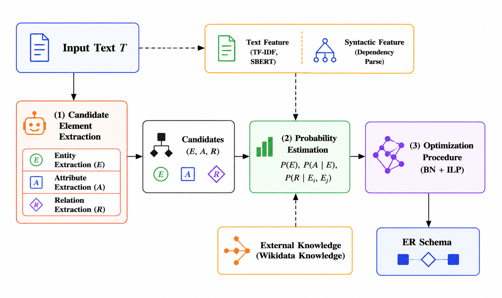

# ER Schema Generation from Text via Multi-LLMs and Bayesian Networks

> Automated ER schema generation from natural language text using a multi-LLM candidate extraction pipeline, Bayesian Network probability estimation, and ILP-based optimization.

---

## Overview



Given an input text *T*, the system produces a structured ER schema through three stages:

1. **Candidate Element Extraction** — Multiple LLMs (GPT-4o, Llama-3) independently extract candidate entities (*E*), attributes (*A*), and relations (*R*).
2. **Probability Estimation** — A Bayesian Network scores each candidate using text features (TF-IDF, SBERT), syntactic features (dependency parsing), and external knowledge (Wikidata).
3. **Optimization** — An Integer Linear Program (ILP) selects the globally consistent ER schema that maximises the total probability.

---

## Methods & Baselines

| Method | LLM | Bayesian Network | # Steps |
|--------|-----|:----------------:|:--------:|
| **Our Approach** | | | |
| **Multi-LLM-BN-Llama3** | Llama-3 | Yes | Multi |
| **Baselines** | | | |
| Text-To-ERD (Llama3) | Llama-3 | — | One |
| Text-To-ERD (GPT) | GPT | — | One |
| DSL-ToT-DM | GPT | — | Multi (ToT) |
| SchemaAgent | GPT | — | Multi |
| **Variants** | | | |
| Multi-LLM-BN-NoWiki-Llama3 | Llama-3 | Yes (w/o Wikidata) | Multi |
| Multi-LLM-noBN-Llama3 | Llama-3 | No | Multi |
| One-LLM-BN-Llama3 | Llama-3 | Yes | One |
| One-LLM-BN-NoWiki-Llama3 | Llama-3 | Yes (w/o Wikidata) | One |
| One-LLM-noBN-Llama3 | Llama-3 | No | One |

---

## Repository Structure

```
├── src/                    # Core library (BN processing, ILP, LLM setup)
├── generation/             # LLM generation scripts
│   ├── multi-llms/         # Multi-LLM pipeline (GPT + Llama, few/zero-shot)
│   ├── one-llms/           # Single-LLM baseline
│   └── ToT/                # Tree-of-Thoughts generation
├── pro_estimation/         # Probability estimation scripts
├── optimization/           # ILP optimization scripts
├── lambda_tuning/          # Lambda hyperparameter search
├── evaluation/             # Evaluation and metrics scripts
├── ablation/               # Ablation study (w/ vs w/o Wikidata)
├── train/                  # BERT relationship classifier training
├── dataset/                # Benchmark dataset (500 exercises)
├── results/                # Evaluation results (F1, figures, LaTeX tables)
└── plots_extend/           # Extended analysis plots
```

---

## Requirements

```bash
pip install -r requirements.txt
```

Key dependencies: `openai`, `groq`, `sentence-transformers`, `spacy`, `pulp`, `scikit-learn`, `pgmpy`, `torch`.

---

## Running the Pipeline

### Step 1 — Generate Candidate Elements

```bash
# Multi-LLM few-shot (Llama via Groq)
python generation/multi-llms/multi-llms-gen-few_shot_llama.py

# Multi-LLM few-shot (GPT)
python generation/multi-llms/multi-llms-gen-few_shot_gpt.py
```

### Step 2 — Estimate Probabilities

```bash
python pro_estimation/run_pro_estimation_pipeline.py
```

### Step 3 — Run ILP Optimization

```bash
python optimization/Multi-llms/opt_fewshot_llama_0.5_1.0.py
```

### Step 4 — Evaluate

```bash
python evaluation/evaluate_all_multi_llms.py
```

---

## Dataset

The benchmark contains **250 natural language descriptions** with manually annotated ER schemas covering diverse domains (academic, business, healthcare, etc.).

```
dataset/
├── Input/          # Raw text descriptions
├── Reference/      # Ground-truth ER schemas
└── Full-Dataset/   # Full annotated dataset with metadata
```

---

## Ablation Study

The `ablation/` folder contains a drop-in replacement pipeline that removes Wikidata knowledge, used to quantify its contribution to probability estimation accuracy.

```bash
python ablation/train/train_bert_relationship.py   # retrain without Wikidata features
```

---

## Results

Pre-computed evaluation results and figures are in `results/`:

| Folder | Content |
|--------|---------|
| `results/F1Score/` | Per-exercise F1 scores (all pipelines) |
| `results/figures/` | Comparison plots |
| `results/Reading/LaTeX_Tables/` | Ready-to-use LaTeX tables |

---

## Supplementary Material

See [`supp_er_generation.pdf`](supp_er_generation.pdf) for additional experimental details.

---


